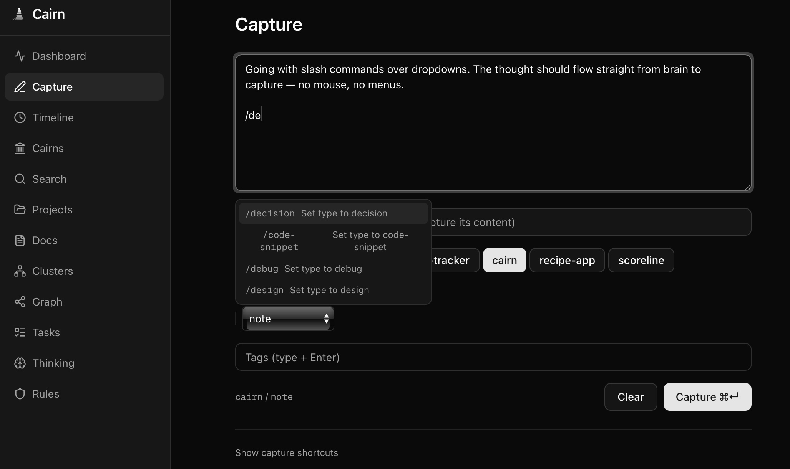

<p align="center">
  
</p>

<p align="center">
  <a href="https://github.com/jasondostal/cairn-mcp/releases"></a>
  <a href="LICENSE"></a>
  
  
  <br>
  
  
  
  
  
</p>

---

Your agent stores a decision at 2am. You capture a thought from your phone over coffee. A week later you vaguely describe what you remember and both come back. We benchmarked that claim. It holds up.

*"Where did I put that singularity again? Let me just spawn a couple..."* — Drop a message in the inbox, hit spawn, and an autonomous agent picks it up with full project context. Rules, memories, trail markers — everything it needs to work like it's been on the team for months.

There's a private LLM that lives inside your memory. Ask it what you decided about the auth system three weeks ago — from your phone, at midnight. It searches everything you've ever stored, pulls the details, and answers like a colleague who was in every meeting. It runs on your hardware — or on frontier models through Bedrock, just as private. Nobody else sees it.

Cairn is a self-hosted memory system for AI agents and humans. Store something once — it gets embedded, enriched, linked to a knowledge graph, and connected to everything related. Hook into your IDE and every tool call gets captured automatically. At session end, everything crystallizes into a trail marker. Next session starts warm. Humans get the same pool — type a thought, slash-command it, grab a URL, share from your phone.

There's a web dashboard — browse your documents, watch session replays, explore a knowledge graph, see analytics and patterns. What your agents actually did, not just what they told you.

Four containers. One `docker compose up`. Done.

<p align="center">
  
</p>

## What you get

- **Session continuity** — Cairns mark the trail. Motes capture what happened. Narratives synthesize why it mattered. Next session starts warm, not cold.
- **Quick capture** — Slash commands (`/decision`, `/learning`), URL extraction, browser bookmarklet, iOS Shortcut. Keyboard-first, Tana-inspired.
- **Smart ingestion** — Text, URLs, or both. Auto-classifies, chunks large documents, deduplicates, and routes. One endpoint, many doorways.
- **Hybrid search** — Vector similarity + full-text + tag matching via Reciprocal Rank Fusion. Cross-encoder reranking, chain-of-thought answer generation.
- **Auto-enrichment** — Every memory gets an LLM-generated summary, tags, importance score, and relationship links on store.
- **Pattern discovery** — HDBSCAN clustering finds themes across memories. LLM writes the labels. Clusters refresh lazily.
- **Web terminal** — SSH into your hosts from the browser. Two backends: native (xterm.js + WebSocket + asyncssh proxy with encrypted credential storage) or ttyd (iframe embed). Host management UI. Feature-flagged, disabled by default.
- **Agent workspace** — Dispatch autonomous coding agents from the dashboard. Cairn assembles project context (rules, memories, trail) and injects it into an [OpenCode](https://github.com/opencode-ai/opencode) session. Chat, view diffs, abort. Requires a separately running OpenCode worker. Optional, disabled by default.
- **Messages** — inter-agent communication. Agents leave notes for each other and for you. Inbox UI with project filtering, priority, and batch operations.
- **Web dashboard** — 24 pages. Chart-heavy home dashboard with KPI sparklines, operations/token/memory-growth charts, activity heatmap. Search with score breakdowns, knowledge graph, thinking trees, live session viewer, chat with tool calling, multi-select filters, Cmd+K, keyboard nav, dark mode.
- **Four containers, done** — MCP at `/mcp`, REST at `/api`, same process. PostgreSQL + pgvector, Neo4j knowledge graph. Bring your own LLM — Ollama, Bedrock, Gemini, or anything OpenAI-compatible.

<h3 align="center">81.7% on LoCoMo</h3>
<p align="center"><em>The standard benchmark for conversational memory systems (<a href="https://arxiv.org/abs/2402.09753">Maharana et al., ACL 2024</a>)</em></p>
<p align="center">
  <sub>adversarial 85.1% · open-domain 82.9% · multi-hop 79.7% · temporal 80.8% · single-hop 76.6%</sub><br>
  <sub>OpenAI Memory 52.9% · LangMem 58.1% · Mem0 68.5% · Letta 74.0% · Zep 75.1% — scores from published papers</sub>
</p>

| | Cairn | OpenAI Memory | LangMem | Mem0 | Zep | Letta |
|---|:---:|:---:|:---:|:---:|:---:|:---:|
| **LoCoMo score** | **81.7%** | 52.9% | 58.1% | 68.5% | 75.1% | 74.0% |
| **Self-hosted / OSS** | ✅ | ❌ | ✅ | ⚠️ | ⚠️ | ✅ |
| **Human capture** | ✅ | ⚠️ | ❌ | ❌ | ❌ | ❌ |
| **Web dashboard** | ✅ | ❌ | ❌ | ❌ | ✅ | ✅ |
| **MCP native** | ✅ | ❌ | ❌ | ❌ | ❌ | ❌ |
| **Knowledge graph** | ✅ | ❌ | ❌ | ✅ | ✅ | ❌ |
| **Session continuity** | ✅ | ⚠️ | ❌ | ❌ | ❌ | ❌ |
| **Cross-encoder reranking** | ✅ | ❌ | ❌ | ❌ | ❌ | ❌ |
| **Clustering / patterns** | ✅ | ❌ | ❌ | ❌ | ❌ | ❌ |
| **Agent dispatch** | ✅ | ❌ | ❌ | ❌ | ❌ | ❌ |

<sub>Feature claims verified via official docs, GitHub repos, and published papers (Feb 2026). Mem0/Zep "partial" OSS: core is open source, advanced features require cloud. OpenAI "chat only" capture: users can say "remember this" in conversation. OpenAI "limited" sessions: references past chats but no structured session markers. Zep dashboard is cloud-only. Letta dashboard is their ADE (Agent Development Environment).</sub>

> **Active development.** Cairn is under rabid, daily development. It's a real system used in production, but it's also a learning vehicle — the architecture evolves as we learn what actually works for agent memory. We strive to avoid major breaking changes, and migrations handle schema evolution automatically. That said: things move fast. If something breaks, open an issue. Benchmarks are periodically re-evaluated as the system evolves.

## Quick Start

### 1. Pull and run

```bash
curl -O https://raw.githubusercontent.com/jasondostal/cairn-mcp/main/docker-compose.yml
docker compose up -d
```

This starts four containers:
- **cairn** — MCP server + REST API on port 8000
- **cairn-ui** — Web dashboard on port 3000
- **cairn-db** — PostgreSQL 16 with pgvector
- **cairn-graph** — Neo4j 5 knowledge graph

Migrations run automatically. Ready in under a minute.

<details>
<summary>docker-compose.yml</summary>

```yaml
services:
  cairn:
    image: ghcr.io/jasondostal/cairn-mcp:latest
    container_name: cairn
    restart: unless-stopped
    environment:
      CAIRN_DB_HOST: "${CAIRN_DB_HOST:-cairn-db}"
      CAIRN_DB_PORT: "${CAIRN_DB_PORT:-5432}"
      CAIRN_DB_NAME: "${CAIRN_DB_NAME:-cairn}"
      CAIRN_DB_USER: "${CAIRN_DB_USER:-cairn}"
      CAIRN_DB_PASS: "${CAIRN_DB_PASS:-cairn-dev-password}"
      CAIRN_LLM_BACKEND: "${CAIRN_LLM_BACKEND:-ollama}"
      CAIRN_BEDROCK_MODEL: "${CAIRN_BEDROCK_MODEL:-us.meta.llama3-2-90b-instruct-v1:0}"
      CAIRN_OLLAMA_URL: "${CAIRN_OLLAMA_URL:-http://host.docker.internal:11434}"
      CAIRN_OLLAMA_MODEL: "${CAIRN_OLLAMA_MODEL:-qwen2.5-coder:7b}"
      CAIRN_CORS_ORIGINS: "${CAIRN_CORS_ORIGINS:-*}"
      CAIRN_AUTH_ENABLED: "${CAIRN_AUTH_ENABLED:-false}"
      CAIRN_API_KEY: "${CAIRN_API_KEY:-}"
      CAIRN_AUTH_HEADER: "${CAIRN_AUTH_HEADER:-X-API-Key}"
      CAIRN_TRANSPORT: "${CAIRN_TRANSPORT:-http}"
      CAIRN_EVENT_ARCHIVE_DIR: "${CAIRN_EVENT_ARCHIVE_DIR:-/data/events}"
      # Embedding backend (bedrock or local)
      CAIRN_EMBEDDING_BACKEND: "${CAIRN_EMBEDDING_BACKEND:-local}"
      CAIRN_EMBEDDING_DIMENSIONS: "${CAIRN_EMBEDDING_DIMENSIONS:-384}"
      CAIRN_EMBEDDING_BEDROCK_MODEL: "${CAIRN_EMBEDDING_BEDROCK_MODEL:-amazon.titan-embed-text-v2:0}"
      # Neo4j graph backend (set CAIRN_GRAPH_BACKEND=neo4j to enable)
      CAIRN_GRAPH_BACKEND: "${CAIRN_GRAPH_BACKEND:-}"
      CAIRN_NEO4J_URI: "${CAIRN_NEO4J_URI:-bolt://cairn-graph:7687}"
      CAIRN_NEO4J_USER: "${CAIRN_NEO4J_USER:-neo4j}"
      CAIRN_NEO4J_PASSWORD: "${CAIRN_NEO4J_PASSWORD:-cairn-dev-password}"
      # AWS credentials for Bedrock (ignored when using Ollama)
      AWS_ACCESS_KEY_ID: "${AWS_ACCESS_KEY_ID:-}"
      AWS_SECRET_ACCESS_KEY: "${AWS_SECRET_ACCESS_KEY:-}"
      AWS_DEFAULT_REGION: "${AWS_DEFAULT_REGION:-us-east-1}"
    ports:
      - "${CAIRN_HTTP_PORT:-8000}:8000"
    volumes:
      - cairn-events:/data/events
    healthcheck:
      test: ["CMD-SHELL", "python -c \"import urllib.request; urllib.request.urlopen('http://localhost:8000/api/status')\""]
      interval: 15s
      timeout: 5s
      retries: 3
      start_period: 30s
    depends_on:
      cairn-db:
        condition: service_healthy

  cairn-ui:
    image: ghcr.io/jasondostal/cairn-mcp-ui:latest
    container_name: cairn-ui
    restart: unless-stopped
    environment:
      CAIRN_API_URL: http://cairn:8000
      CAIRN_API_KEY: "${CAIRN_API_KEY:-}"
    ports:
      - "${CAIRN_UI_PORT:-3000}:3000"
    healthcheck:
      test: ["CMD-SHELL", "node -e \"fetch('http://localhost:3000/').then(r=>{if(!r.ok)process.exit(1)}).catch(()=>process.exit(1))\""]
      interval: 15s
      timeout: 5s
      retries: 3
      start_period: 10s
    depends_on:
      - cairn

  cairn-db:
    image: pgvector/pgvector:pg16
    container_name: cairn-db
    restart: unless-stopped
    environment:
      POSTGRES_DB: "${CAIRN_DB_NAME:-cairn}"
      POSTGRES_USER: "${CAIRN_DB_USER:-cairn}"
      POSTGRES_PASSWORD: "${CAIRN_DB_PASS:-cairn-dev-password}"
    volumes:
      - cairn-pgdata:/var/lib/postgresql/data
    healthcheck:
      test: ["CMD-SHELL", "pg_isready -U cairn"]
      interval: 5s
      timeout: 5s
      retries: 5

  cairn-graph:
    image: neo4j:5-community
    container_name: cairn-graph
    restart: unless-stopped
    ports:
      - "${CAIRN_NEO4J_HTTP_PORT:-7474}:7474"
      - "${CAIRN_NEO4J_BOLT_PORT:-7687}:7687"
    environment:
      NEO4J_AUTH: "${CAIRN_NEO4J_USER:-neo4j}/${CAIRN_NEO4J_PASSWORD:-cairn-dev-password}"
      NEO4J_PLUGINS: '["apoc"]'
    volumes:
      - cairn-neo4j:/data
    healthcheck:
      test: ["CMD-SHELL", "wget --no-verbose --tries=1 --spider http://localhost:7474 || exit 1"]
      interval: 10s
      timeout: 10s
      retries: 10
      start_period: 30s

volumes:
  cairn-pgdata:
  cairn-events:
  cairn-neo4j:
```

</details>

### 2. Connect your IDE

Add Cairn to your IDE's MCP config — the JSON is the same everywhere:

```json
{
  "mcpServers": {
    "cairn": {
      "type": "http",
      "url": "http://localhost:8000/mcp"
    }
  }
}
```

| IDE | Where to put it |
|-----|----------------|
| **Claude Code** | `.mcp.json` (project) or `claude mcp add --transport http cairn http://localhost:8000/mcp` |
| **Cursor** | `.cursor/mcp.json` |
| **Windsurf** | `.windsurf/mcp.json` or `~/.codeium/windsurf/mcp.json` |
| **Cline** (VS Code) | Cline MCP settings panel |
| **Continue** | `.continue/config.yaml` (YAML format) |

Or run the setup script to auto-detect your IDEs and configure everything:

```bash
git clone https://github.com/jasondostal/cairn-mcp.git
./cairn-mcp/scripts/setup.sh
```

<details>
<summary>stdio transport (single-client, same host)</summary>

If your MCP client doesn't support HTTP transport, use stdio:

```json
{
  "mcpServers": {
    "cairn": {
      "command": "docker",
      "args": ["exec", "-i", "cairn", "python", "-m", "cairn.server"]
    }
  }
}
```

Note: stdio connects one client directly to the container. HTTP is preferred — it supports multiple concurrent clients and works across the network.

</details>

### 3. Store your first memory

Once connected, your agent can immediately use all 15 tools. Try:

> "Remember that we chose PostgreSQL with pgvector for the storage layer because it gives us hybrid search without a separate vector database."

Cairn will store it, generate a summary, auto-tag it, and score its importance.

## Prerequisites

Cairn needs an **LLM backend** for enrichment, relationship extraction, and session narrative synthesis. Choose one:

| Backend | Setup | Best for |
|---------|-------|----------|
| **Ollama** (default) | Install [Ollama](https://ollama.com), pull a model (`ollama pull qwen2.5-coder:7b`). Cairn connects to `host.docker.internal:11434`. | Local development, no cloud dependency |
| **AWS Bedrock** | Set `CAIRN_LLM_BACKEND=bedrock`, export AWS credentials. Requires model access in your AWS account. | Production, larger models |
| **Google Gemini** | Set `CAIRN_LLM_BACKEND=gemini`, add `CAIRN_GEMINI_API_KEY`. Free tier available. | Quick start, no infrastructure |
| **OpenAI-compatible** | Set `CAIRN_LLM_BACKEND=openai`, add `CAIRN_OPENAI_API_KEY` and optionally `CAIRN_OPENAI_BASE_URL`. | OpenAI, Groq, Together, Mistral, LM Studio, vLLM — anything that speaks the OpenAI chat format |

The LLM backend is pluggable. Custom providers can be registered via `register_llm_provider(name, factory_fn)` in Python. Gemini and OpenAI implementations use zero external SDKs — just `urllib` with built-in retry logic.

**No LLM? Cairn still works.** Core features — store, search, recall, cairns, rules — function without an LLM. You lose auto-enrichment (summaries, tags, importance scoring), relationship extraction, and session narrative synthesis. Memories are still embedded and searchable.

> **Security note:** The default `docker-compose.yml` ships with a development database password (`cairn-dev-password`). This is intentional for quick local setup. For any network-exposed deployment, override it: `CAIRN_DB_PASS=your-secure-password docker compose up -d`. You can also enable API key auth: set `CAIRN_AUTH_ENABLED=true` and `CAIRN_API_KEY=your-secret` to protect all `/api` routes.

---

<details>
<summary><strong>Three-Tier Knowledge Capture</strong></summary>

Most agent memory systems require the agent to explicitly decide what's worth remembering. Cairn captures knowledge at three levels simultaneously, with each tier working independently:

| Tier | How it works | Agent effort | What's captured |
|------|-------------|-------------|----------------|
| **Tier 3: Hook-automated** | IDE lifecycle hooks (Claude Code, Cursor, Windsurf, Cline) silently log every tool call as a *mote* (lightweight event). At session end, the full event stream is crystallized into a cairn with an LLM-synthesized narrative. | Zero | Everything — files read, edits made, commands run, searches performed |
| **Tier 2: Tool-assisted** | Agent calls `cairns(action="set")` at session end to mark a trail marker. Works without hooks. | One tool call | All memories stored during the session |
| **Tier 1: Organic** | Agent stores memories via behavioral rules — decisions, learnings, dead ends. Works without cairns. | Per-insight | Deliberate observations the agent deems important |

The tiers are additive and degrade gracefully. With all three active, a session produces: a rich narrative synthesized from both the mote timeline *and* stored memories, linked trail markers for next session's context, and individually searchable memories with auto-enrichment. Remove the hooks? Tier 2 and 1 still work. Agent forgets to set a cairn? The organic memories are still there.

**Next session, the agent walks the trail back.** Session-start hooks (or adapter equivalents) load recent cairn narratives into context — the agent picks up where the last one left off, not from a blank slate.

</details>

<details>
<summary><strong>Session Capture & Hooks</strong></summary>

Cairn can automatically capture your entire session — every tool call logged as a lightweight event (*mote*), crystallized into a cairn when the session ends. Next session, the agent starts with context instead of a blank slate.

**Quick setup:**

```bash
git clone https://github.com/jasondostal/cairn-mcp.git
./cairn-mcp/scripts/setup.sh
```

The setup script detects your installed IDEs, configures MCP connections, and optionally installs hook adapters. Run with `--dry-run` to preview changes. See [`examples/hooks/README.md`](examples/hooks/README.md) for manual setup, per-IDE details, and troubleshooting.

**IDE hook capabilities:**

| IDE | Session start | Tool capture | Session end | Auto-cairn |
|-----|:---:|:---:|:---:|:---:|
| Claude Code | yes | yes | yes | yes |
| Cursor | yes | yes | yes | yes |
| Cline | yes | yes | yes | yes |
| Windsurf | auto* | yes | manual | manual |
| Continue | — | — | — | — |

\*Windsurf: session initializes on first tool use. No session-end hook — the agent calls `cairns(action="set")` directly.

**What happens (Pipeline v2):**
1. **Session starts** — hook fetches recent cairns for context, creates an event log in `~/.cairn/events/`
2. **Every tool call** — hook captures full `tool_input` and `tool_response` (capped at 2000 chars), appends to the log. Every 25 events, a batch is shipped to `POST /api/events/ingest` in the background.
3. **Between batches** — DigestWorker on the server digests each batch into a 2-4 sentence LLM summary, producing rolling context.
4. **Session ends** — hook ships any remaining events, then POSTs a cairn. The server synthesizes a narrative from the pre-digested summaries — not raw events. Events are archived to `~/.cairn/events/archive/`.

The agent (via MCP tool) and the hook (via REST POST) can both set a cairn for the same session — whichever arrives first creates it, the second merges in what was missing. No race conditions.

No hooks? No problem. The `cairns` tool works without them — the agent can call `cairns(action="set")` directly. And even without cairns, memories stored with a `session_name` are still grouped and searchable.

</details>

<details>
<summary><strong>MCP Tools</strong> — 15 tools</summary>

| Tool | What it does |
|------|-------------|
| `store` | Persist a memory with auto-enrichment, relationship extraction, and rule conflict detection |
| `search` | Hybrid semantic search with query expansion and optional confidence gating |
| `recall` | Expand memory IDs to full content with cluster context |
| `modify` | Update, soft-delete, reactivate, or move memories between projects |
| `rules` | Behavioral guardrails — global or per-project |
| `insights` | HDBSCAN clustering with LLM-generated pattern summaries |
| `projects` | Documents (briefs, PRDs, plans, primers, writeups, guides) and cross-project linking |
| `tasks` | Task lifecycle — create, complete, list, link to memories |
| `think` | Structured reasoning sequences with branching |
| `status` | System health, counts, embedding model info, active LLM capabilities |
| `synthesize` | Synthesize session memories into a coherent narrative |
| `consolidate` | Find duplicate memories, recommend merges/promotions/inactivations |
| `cairns` | Session markers — set at session end, walk the trail back, compress old ones |
| `drift_check` | Compare file content hashes to detect stale code-related memories |
| `messages` | Inter-agent messaging — send, inbox, mark read, archive, unread count |

</details>

<details>
<summary><strong>REST API</strong> — 55 endpoints</summary>

REST endpoints at `/api` — powers the web UI, hook scripts, and scripting. Optional API key auth when `CAIRN_AUTH_ENABLED=true`.

| Endpoint | Description |
|----------|-------------|
| `GET /api/status` | System health, version, memory counts, cluster info |
| `GET /api/settings` | Current settings with source tracking and pending restart flag |
| `PATCH /api/settings` | Bulk update editable settings |
| `DELETE /api/settings/{key}` | Remove a single DB setting override |
| `GET /api/search?q=&project=&type=&mode=&limit=` | Hybrid search (multi-select: `project=a,b`) |
| `GET /api/memories/:id` | Single memory with cluster context |
| `GET /api/projects` | All projects with memory counts |
| `GET /api/projects/:name` | Project docs and links |
| `GET /api/docs?project=&doc_type=` | Browse documents across projects |
| `GET /api/docs/:id` | Single document with full content |
| `GET /api/clusters?project=&topic=` | Clusters with member lists |
| `GET /api/tasks?project=` | Tasks for a project |
| `POST /api/tasks/{id}/complete` | Mark a task as completed |
| `GET /api/messages/unread-count?project=` | Unread message count |
| `GET /api/messages?project=` | Message inbox |
| `POST /api/messages` | Send a message |
| `PATCH /api/messages/{id}` | Mark read or archive a message |
| `POST /api/messages/mark-all-read?project=` | Mark all messages read |
| `GET /api/thinking?project=&status=` | Thinking sequences |
| `GET /api/thinking/:id` | Sequence detail with all thoughts |
| `GET /api/rules?project=` | Behavioral rules |
| `GET /api/timeline?project=&type=&days=` | Memory activity feed (multi-select filters) |
| `GET /api/cairns?project=` | Session trail — cairns newest first |
| `GET /api/cairns/:id` | Single cairn with linked memories |
| `POST /api/cairns` | Set a cairn (used by session-end hook) |
| `GET /api/events?session_name=&project=` | Event batches with digest status |
| `POST /api/events/ingest` | Ship event batch (202 Accepted, idempotent) |
| `POST /api/ingest` | Smart ingestion — text, URL, or both. Classify, chunk, dedup, route. |
| `POST /api/ingest/doc` | Create a single project document |
| `POST /api/ingest/docs` | Batch create multiple documents (partial success) |
| `POST /api/ingest/memory` | Store a memory via REST (full pipeline) |
| `GET /api/bookmarklet.js` | Browser bookmarklet script for one-click capture |
| `GET /api/clusters/visualization?project=` | t-SNE 2D coordinates for scatter plot |
| `GET /api/export?project=&format=` | Export project memories (JSON or Markdown) |
| `GET /api/graph?project=&relation_type=` | Knowledge graph nodes and edges |
| `GET /api/analytics/overview?days=` | KPI summary with sparklines |
| `GET /api/analytics/timeseries?days=&granularity=` | Time-bucketed operations, tokens, errors |
| `GET /api/analytics/operations?days=&project=&operation=` | Operations breakdown with filters |
| `GET /api/analytics/projects?days=` | Per-project usage breakdown with trends |
| `GET /api/analytics/models?days=` | Model performance with latency percentiles |
| `GET /api/analytics/memory-growth?days=&granularity=` | Cumulative memory counts by type |
| `GET /api/analytics/sparklines?days=` | Entity creation sparklines (memories, cairns, projects, clusters) |
| `GET /api/analytics/heatmap?days=` | Daily activity counts for heatmap visualization |
| `POST /api/chat` | Send messages to the embedded LLM (agentic, with tool calling) |
| `GET /api/sessions?project=` | Recent sessions with event counts and digest status |
| `GET /api/sessions/{name}/events` | Event stream + digests for a session |
| `GET /api/drift?project=` | Check for memories with stale file references |
| `POST /api/drift` | Submit file hashes for drift comparison |
| `GET /api/terminal/config` | Terminal backend mode and settings |
| `GET /api/terminal/hosts` | List configured terminal hosts |
| `POST /api/terminal/hosts` | Add a terminal host |
| `GET /api/terminal/hosts/{id}` | Get host details |
| `PATCH /api/terminal/hosts/{id}` | Update a terminal host |
| `DELETE /api/terminal/hosts/{id}` | Soft-delete a terminal host |
| `WS /api/terminal/ws/{host_id}` | WebSocket terminal proxy (native mode) |

```bash
curl http://localhost:8000/api/status
curl "http://localhost:8000/api/search?q=architecture&limit=5"
```

</details>

<details>
<summary><strong>Architecture</strong></summary>

```
Browser         Bookmarklet / iOS     MCP Client (Claude, etc.)     curl / scripts
   |                  |                      |                            |
   | HTTPS            | POST /api/ingest     | stdio or streamable-http   | REST
   |                  |                      |                            |
+--v---+          +---v----------------------v----------------------------v------+
| Next | -proxy-> |  /mcp  (MCP protocol)              /api  (REST API)          |
| .js  |          |                                                               |
| UI   |          |  cairn.server  (MCP tool definitions)                         |
+------+          |  cairn.api     (FastAPI endpoints + ingest pipeline)          |
cairn-ui          |                                                               |
                  |  core: memory, search, enrichment, clustering, ingest        |
                  |        extraction, router, reranker, search_v2              |
                  |        projects, tasks, thinking, cairns                     |
                  |        synthesis, consolidation, digest                      |
                  |                                                               |
                  |  graph: Neo4j (entities, statements, triples, BFS)          |
                  |  embedding: local (MiniLM), Bedrock (Titan V2) (pluggable)   |
                  |  llm: Ollama, Bedrock, Gemini, OpenAI-compat (pluggable)     |
                  |  storage: PostgreSQL 16 + pgvector (HNSW)                    |
                  +---------------------------------------------------------------+
                      |                           |
                      v                           v
                  PostgreSQL 16 + pgvector    Neo4j 5 (knowledge graph)
```

</details>

<details>
<summary><strong>Search</strong></summary>

Cairn fuses four signals with **Reciprocal Rank Fusion (RRF)**:

| Signal | Weight | How |
|--------|--------|-----|
| Vector similarity | 50% | Cosine distance via pgvector HNSW index. Local (MiniLM, 384-dim) or Bedrock Titan V2 (up to 1024-dim) — [configurable](#configuration). |
| Recency | 20% | Newer memories rank higher by `updated_at` |
| Keyword search | 20% | PostgreSQL `ts_rank` full-text search |
| Tag matching | 10% | Intersection of query-derived tags with memory tags |

Filter by project(s), memory type(s), file path, recency, or set custom limits. Multi-select supported — pass comma-separated values (e.g. `?project=cairn,llm-context&type=decision,learning`). Three modes: `semantic` (hybrid, default), `keyword`, or `vector`.

</details>

<details>
<summary><strong>Configuration</strong></summary>

All via environment variables:

| Variable | Default | Description |
|----------|---------|-------------|
| `CAIRN_DB_HOST` | `cairn-db` | PostgreSQL host |
| `CAIRN_DB_PORT` | `5432` | PostgreSQL port |
| `CAIRN_DB_NAME` | `cairn` | Database name |
| `CAIRN_DB_USER` | `cairn` | Database user |
| `CAIRN_DB_PASS` | *(required)* | Database password |
| `CAIRN_LLM_BACKEND` | `ollama` | `ollama`, `bedrock`, `gemini`, or `openai` |
| `CAIRN_OLLAMA_URL` | `http://host.docker.internal:11434` | Ollama API URL |
| `CAIRN_OLLAMA_MODEL` | `qwen2.5-coder:7b` | Ollama model name |
| `CAIRN_BEDROCK_MODEL` | `us.meta.llama3-2-90b-instruct-v1:0` | Bedrock model ID |
| `AWS_ACCESS_KEY_ID` | *(empty)* | AWS access key for Bedrock |
| `AWS_SECRET_ACCESS_KEY` | *(empty)* | AWS secret key for Bedrock |
| `AWS_DEFAULT_REGION` | `us-east-1` | AWS region for Bedrock |
| `CAIRN_GEMINI_MODEL` | `gemini-2.0-flash` | Google Gemini model name |
| `CAIRN_GEMINI_API_KEY` | *(empty)* | Gemini API key |
| `CAIRN_OPENAI_BASE_URL` | `https://api.openai.com` | OpenAI-compatible API base URL |
| `CAIRN_OPENAI_MODEL` | `gpt-4o-mini` | OpenAI-compatible model name |
| `CAIRN_OPENAI_API_KEY` | *(empty)* | OpenAI-compatible API key |
| `CAIRN_TRANSPORT` | `stdio` | `stdio` or `http` |
| `CAIRN_HTTP_HOST` | `0.0.0.0` | HTTP bind address |
| `CAIRN_HTTP_PORT` | `8000` | HTTP listen port |
| `CAIRN_CORS_ORIGINS` | `*` | Comma-separated CORS origins, or `*` for all |
| `CAIRN_AUTH_ENABLED` | `false` | Enable API key authentication on `/api` routes |
| `CAIRN_API_KEY` | *(empty)* | API key (required when auth enabled) |
| `CAIRN_AUTH_HEADER` | `X-API-Key` | Header name to check for API key (configurable for auth proxy compatibility) |
| `CAIRN_EVENT_ARCHIVE_DIR` | *(disabled)* | File path for event archive (e.g. `/data/events`) |
| `CAIRN_EMBEDDING_BACKEND` | `local` | Embedding provider: `local` (SentenceTransformer), `bedrock` (Titan V2), or custom registered name |
| `CAIRN_EMBEDDING_MODEL` | `all-MiniLM-L6-v2` | Sentence transformer model (local backend) |
| `CAIRN_EMBEDDING_DIMENSIONS` | `384` | Embedding vector dimensions. Auto-reconciled on startup if changed. |
| `CAIRN_EMBEDDING_BEDROCK_MODEL` | `amazon.titan-embed-text-v2:0` | Bedrock embedding model ID |
| `CAIRN_EMBEDDING_BEDROCK_REGION` | `us-east-1` | AWS region for Bedrock embedding (falls back to `AWS_DEFAULT_REGION`) |
| `CAIRN_INGEST_CHUNK_SIZE` | `512` | Tokens per chunk for document ingestion |
| `CAIRN_INGEST_CHUNK_OVERLAP` | `64` | Overlap tokens between chunks |
| `CAIRN_LLM_QUERY_EXPANSION` | `true` | Expand search queries with related terms |
| `CAIRN_LLM_RELATIONSHIP_EXTRACT` | `true` | Auto-detect relationships between memories on store |
| `CAIRN_LLM_RULE_CONFLICT_CHECK` | `true` | Check new rules for conflicts with existing rules |
| `CAIRN_LLM_SESSION_SYNTHESIS` | `true` | Enable session narrative synthesis |
| `CAIRN_LLM_CONSOLIDATION` | `true` | Enable memory consolidation recommendations |
| `CAIRN_LLM_CONFIDENCE_GATING` | `false` | Post-search quality assessment (advisory, high reasoning demand) |
| `CAIRN_LLM_EVENT_DIGEST` | `true` | Digest event batches into rolling LLM summaries |
| `CAIRN_TERMINAL_BACKEND` | `disabled` | Terminal mode: `native` (xterm.js + asyncssh), `ttyd` (iframe), or `disabled` |
| `CAIRN_SSH_ENCRYPTION_KEY` | *(empty)* | Fernet key for encrypting SSH credentials (native mode). Generate: `python -c "from cryptography.fernet import Fernet; print(Fernet.generate_key().decode())"` |
| `CAIRN_TERMINAL_MAX_SESSIONS` | `5` | Max concurrent terminal sessions |
| `CAIRN_TERMINAL_CONNECT_TIMEOUT` | `30` | SSH connect timeout in seconds (native mode) |
| `CAIRN_RERANKING` | `false` | Enable cross-encoder reranking after retrieval |
| `CAIRN_RERANKER_BACKEND` | *(empty)* | Reranker provider: `local` (cross-encoder) or `bedrock` (Amazon Rerank) |
| `CAIRN_RERANKER_MODEL` | *(empty)* | Local cross-encoder model name |
| `CAIRN_RERANK_CANDIDATES` | `50` | Number of candidates to rerank |
| `CAIRN_RERANKER_BEDROCK_MODEL` | *(empty)* | Bedrock reranker model ID |
| `CAIRN_RERANKER_REGION` | *(empty)* | AWS region for Bedrock reranker (falls back to `AWS_DEFAULT_REGION`) |
| `CAIRN_GRAPH_BACKEND` | *(disabled)* | Graph backend: `neo4j` to enable knowledge graph |
| `CAIRN_NEO4J_URI` | `bolt://cairn-graph:7687` | Neo4j Bolt connection URI |
| `CAIRN_NEO4J_USER` | `neo4j` | Neo4j username |
| `CAIRN_NEO4J_PASSWORD` | *(empty)* | Neo4j password |
| `CAIRN_NEO4J_DATABASE` | `neo4j` | Neo4j database name |
| `CAIRN_KNOWLEDGE_EXTRACTION` | `false` | Enable combined entity/statement/triple extraction on store |
| `CAIRN_SEARCH_V2` | `false` | Enable intent-routed search with graph handlers |

</details>

<details>
<summary><strong>Development</strong></summary>

```bash
git clone https://github.com/jasondostal/cairn-mcp.git
cd cairn-mcp
cp .env.example .env   # edit with your settings
docker compose up -d --build
```

### Testing

Tests (run inside container or local venv):

```bash
docker exec cairn pip install pytest
docker cp tests/ cairn:/app/tests/
docker exec cairn python -m pytest tests/ -v
```

### Admin Scripts

Maintenance utilities in `scripts/` (run inside the container):

| Script | Purpose |
|--------|---------|
| `scripts/reembed.py` | Re-embed memories with NULL embeddings after switching embedding backends |
| `scripts/bulk_ops.py demote-progress` | Batch-lower importance of progress-type memories |
| `scripts/bulk_ops.py move-project --from X --to Y` | Move all memories + related data between projects |
| `scripts/bulk_ops.py cleanup-projects` | Inventory projects with active/inactive counts |

All bulk operations support `--dry-run` for preview.

### Database Schema

17 migrations:

| Migration | Tables / Changes |
|-----------|--------|
| **001 Core** | `projects`, `memories`, `memory_related_files`, `memory_related_memories` |
| **002 Clustering** | `clusters`, `cluster_members`, `clustering_runs` |
| **003 Phase 4** | `project_documents`, `project_links`, `tasks`, `task_memory_links`, `thinking_sequences`, `thoughts` |
| **004 Cairns** | `cairns` + `cairn_id` FK on `memories` |
| **005 Indexes** | Partial indexes on `memories` for timeline and session queries |
| **006 Events** | `session_events` — streaming event batches with LLM digests |
| **007 Doc Title** | `title` column on `project_documents` |
| **008 Ingestion** | `ingestion_log` — content-hash dedup, source tracking, chunk counts |
| **009 Drift** | `file_hashes` JSONB column on `memories` for code-aware drift detection |
| **010 Analytics** | `usage_events`, `metric_rollups`, `rollup_state` — usage tracking and pre-aggregated rollups |
| **011 Dashboard Indexes** | Performance indexes for memory-growth, sparkline, and heatmap queries |
| **012 Entities** | Neo4j entity tracking columns |
| **013 Graph Edges** | Graph edge metadata |
| **014 Author** | `author` column on `memories` for speaker attribution |
| **015 Messages** | `messages` — inter-agent communication with priority and read state |
| **016 SSH Hosts** | `ssh_hosts` — terminal host management with encrypted credentials |
| **017 Settings** | `app_settings` — runtime config persistence with key-value store |

</details>

<details>
<summary><strong>Search Quality — Methodology</strong></summary>

We benchmark against **LoCoMo** ([Maharana et al., ACL 2024](https://arxiv.org/abs/2402.09753)) — the standard evaluation for conversational memory systems used by Mem0, Zep, Letta, and others.

- **Embeddings:** Amazon Titan V2 (1024-dim)
- **Answer generation + judging:** Kimi K2.5 via AWS Bedrock
- **Scoring:** LLM-as-judge, 3-level (0.0 / 0.5 / 1.0), generous prompt matching published baselines
- **Dataset:** LoCoMo conversation conv-26, 199 questions across 5 categories
- **All 5 categories included** (some published systems skip adversarial)
- **Competitor scores** sourced from published papers and official documentation

The eval framework lives in `eval/` and supports model comparison, strategy comparison, and per-question failure analysis. Contributions welcome.

</details>

## License

[GNU General Public License v3.0](LICENSE)
