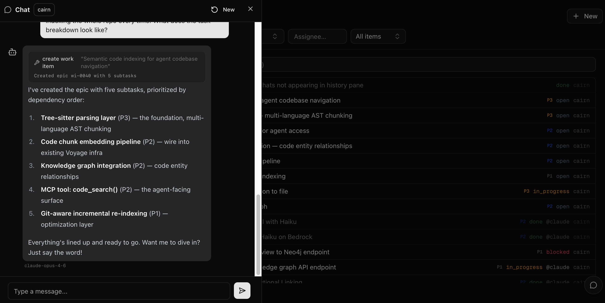
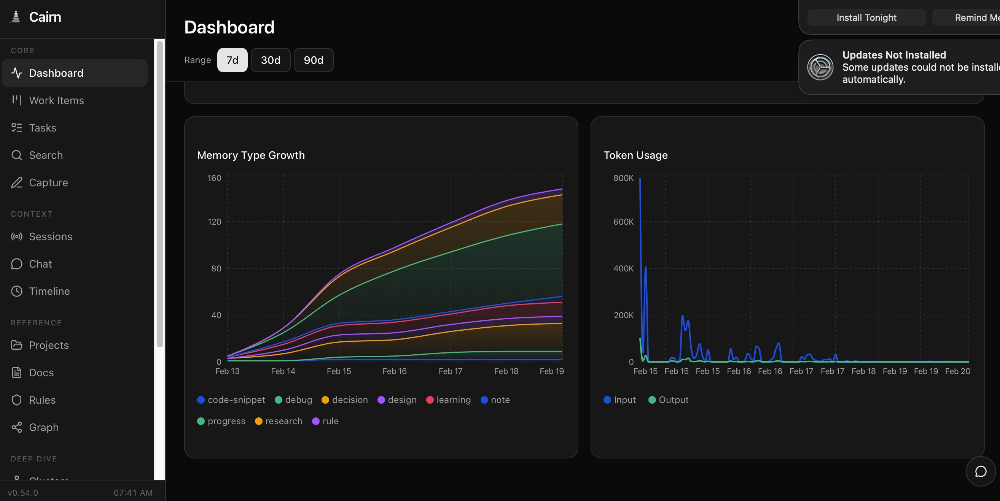

<p align="center">
  
</p>

<p align="center">
  <a href="https://github.com/jasondostal/cairn-mcp/releases"></a>
  <a href="LICENSE"></a>
  
  
</p>

---

Yet another MCP, right? Yeah, it's that. But here's why this one exists.

I'm a t-shaped engineer. PMP, SAFe Agilist, Certified Product Owner. But before any of that, I'm a systems person. Data centers, orchestration, automation. The kind of work that crosses 13 disciplines and stretches back to something you last touched 10 years ago.

I built Cairn for my workflow. At 1am, when I'm deep in something and I know the answer exists somewhere in the last three weeks of work but I don't want to spend 30 minutes digging and correlating. That emergency call, the panicked user coming to you as their only hope, and it's an issue buried in 6 systems you last touched in 2014.

Cairn is there.

*"Where did I put that singularity again? Let me just spawn a couple..."*

Sure, dedicated tools will probably beat a given Cairn feature when it's all they do. Cairn isn't built for single-purpose depth. It's built for the systems person. The curious. The t-shaped. The ones who need a memory that works the way they do, across everything, all at once.

It's a self-hosted memory and orchestration layer for AI agents and humans. Store something once, find it later, across sessions, across projects. Four containers. `docker compose up`. Done.

<p align="center">
  
  <br>
  <sub>Chat creates a work item. Agent breaks it into subtasks. You review from your phone.</sub>
</p>

## Quick Start

### 1. Pull and run

```bash
curl -O https://raw.githubusercontent.com/jasondostal/cairn-mcp/main/docker-compose.yml
docker compose up -d
```

Four containers start:
- **cairn** on port 8000 (MCP server + REST API)
- **cairn-ui** on port 3000 (web dashboard)
- **cairn-db** (PostgreSQL 16 + pgvector)
- **cairn-graph** (Neo4j 5, knowledge graph)

Migrations run on first boot. Ready in about a minute.

### 2. Connect your IDE

Add this to your MCP config:

```json
{
  "mcpServers": {
    "cairn": {
      "type": "http",
      "url": "http://localhost:8000/mcp"
    }
  }
}
```

Where that goes:

| IDE | Config file |
|-----|------------|
| **Claude Code** | `.mcp.json` in your project root |
| **Cursor** | `.cursor/mcp.json` |
| **Windsurf** | `.windsurf/mcp.json` |
| **Cline** | MCP settings panel in VS Code |
| **Continue** | `.continue/config.yaml` |

Or run the setup script:

```bash
git clone https://github.com/jasondostal/cairn-mcp.git && ./cairn-mcp/scripts/setup.sh
```

### 3. Use it

Tell your agent to remember something:

> "Remember that we chose PostgreSQL for storage because it handles hybrid search without a separate vector DB."

Search for it later:

> "What did we decide about the storage layer?"

That's it. 15 tools available. The ones you'll use most:

| Tool | What it does |
|------|-------------|
| `store` | Save a memory with auto-enrichment |
| `search` | Find memories (vector + keyword + recency + tags) |
| `recall` | Get full content for specific memory IDs |
| `orient` | Boot a session with rules, recent activity, and open work |
| `rules` | Load behavioral guardrails (global or per-project) |
| `work_items` | Create, claim, and complete tasks with dependencies and gates |
| `projects` | Manage project docs (briefs, PRDs, plans) |

The rest: `modify`, `insights`, `tasks`, `think`, `status`, `consolidate`, `drift_check`, `ingest`.

## What's in the box

**Memory that persists across sessions.** Your agent makes a decision at 2am. Next morning, different session, it finds that decision. That's the core.

**Search that fuses signals.** Vector similarity, recency, keyword matching, and tag overlap blended via Reciprocal Rank Fusion. Filter by project, type, or time range.

**Knowledge graph.** With Neo4j enabled, entities and facts get extracted into a graph that connects memories through shared people, places, projects, and concepts. Optional, but powerful when you're working across domains.

**Work management.** Hierarchical work items, dependency tracking, a dispatch queue for agents, and gates that pause for human decisions. For when you have agents that need to coordinate.

**Web dashboard.** Browse memories, explore the knowledge graph, view analytics, manage work items, chat with your memory. Port 3000.

<p align="center">
  
  <br>
  <sub>Memory growth by type, token usage tracking, and the full nav.</sub>
</p>

**Session capture.** IDE hooks (Claude Code, Cursor, Cline, Windsurf) log every tool call. Next session boots warm. See [`examples/hooks/README.md`](examples/hooks/README.md).

## Do I need an LLM?

No. Store, search, recall, and rules work without one. You lose auto-enrichment (summaries, tags, importance scoring), knowledge extraction, and chat.

If you want enrichment:

| Backend | Setup |
|---------|-------|
| **Ollama** (default) | Install [Ollama](https://ollama.com), pull a model. Cairn connects to `host.docker.internal:11434`. |
| **AWS Bedrock** | Set `CAIRN_LLM_BACKEND=bedrock`, export AWS creds. |
| **Google Gemini** | Set `CAIRN_LLM_BACKEND=gemini`, add `CAIRN_GEMINI_API_KEY`. Free tier available. |
| **OpenAI-compatible** | Set `CAIRN_LLM_BACKEND=openai`, add key. Works with OpenAI, Groq, Together, LM Studio, vLLM. |

## Configuration

All via environment variables. The ones that matter:

| Variable | Default | What it does |
|----------|---------|-------------|
| `CAIRN_LLM_BACKEND` | `ollama` | LLM provider: `ollama`, `bedrock`, `gemini`, `openai` |
| `CAIRN_DB_PASS` | `cairn-dev-password` | Database password. Change this for anything beyond local. |
| `CAIRN_AUTH_ENABLED` | `false` | API key auth on `/api` routes |
| `CAIRN_API_KEY` | *(empty)* | The API key when auth is enabled |
| `CAIRN_GRAPH_BACKEND` | *(disabled)* | Set to `neo4j` to enable knowledge graph |
| `CAIRN_KNOWLEDGE_EXTRACTION` | `false` | Entity/statement extraction on store |
| `CAIRN_EMBEDDING_BACKEND` | `local` | `local` (MiniLM, 384-dim) or `bedrock` (Titan V2, 1024-dim) |

Full reference is in [docker-compose.yml](docker-compose.yml). Every variable has a sensible default.

## Architecture

```
MCP clients (Claude Code, Cursor, etc.)     REST clients (curl, web UI, hooks)
        |                                            |
        | MCP (stdio or HTTP)                        | REST API
        |                                            |
+-------v--------------------------------------------v--------+
|  cairn.server (MCP tools)     cairn.api (FastAPI endpoints) |
|                                                             |
|  core: memory, search, enrichment, extraction, clustering   |
|        work items, projects, tasks, thinking                |
|                                                             |
|  graph: Neo4j (entities, statements, triples)               |
|  embedding: local (MiniLM) or Bedrock (Titan V2)            |
|  llm: Ollama, Bedrock, Gemini, OpenAI-compatible            |
+------+----------------------------------------------+-------+
       |                                              |
       v                                              v
  PostgreSQL 16 + pgvector                    Neo4j 5 (optional)
```

## Benchmark

Tested against [LoCoMo](https://github.com/snap-stanford/locomo), a long-conversation memory benchmark with 1,986 questions across five categories.

| System | Score | LLM |
|--------|-------|-----|
| **Cairn** | **79.4%** | Llama-3.3-70B |
| Human baseline | 87.9% | — |
| Letta/MemGPT | 74.0% | GPT-4o-mini |
| Mem0 | 66.9% | GPT-4o |

Test configuration: Titan V2 embeddings (Bedrock, 1024-dim), plain RRF search (no optional features enabled), LLM-as-judge evaluation. Full results and methodology in [`eval/`](eval/).

## Development

```bash
git clone https://github.com/jasondostal/cairn-mcp.git
cd cairn-mcp
cp .env.example .env
docker compose up -d --build
```

## Status

Cairn is under active development. It's a real system used daily in production, and it's evolving as I learn what actually works for agent memory. Migrations handle schema changes. If something breaks, [open an issue](https://github.com/jasondostal/cairn-mcp/issues).

## License

[GNU General Public License v3.0](LICENSE)
