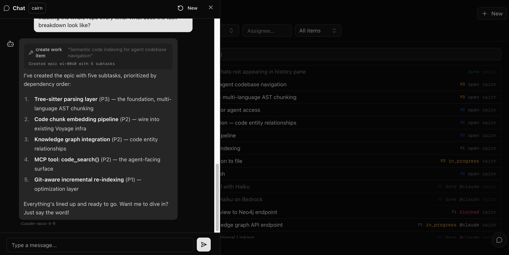
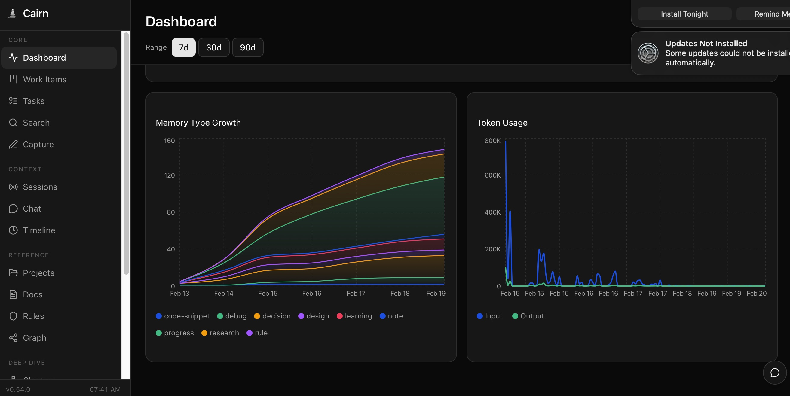
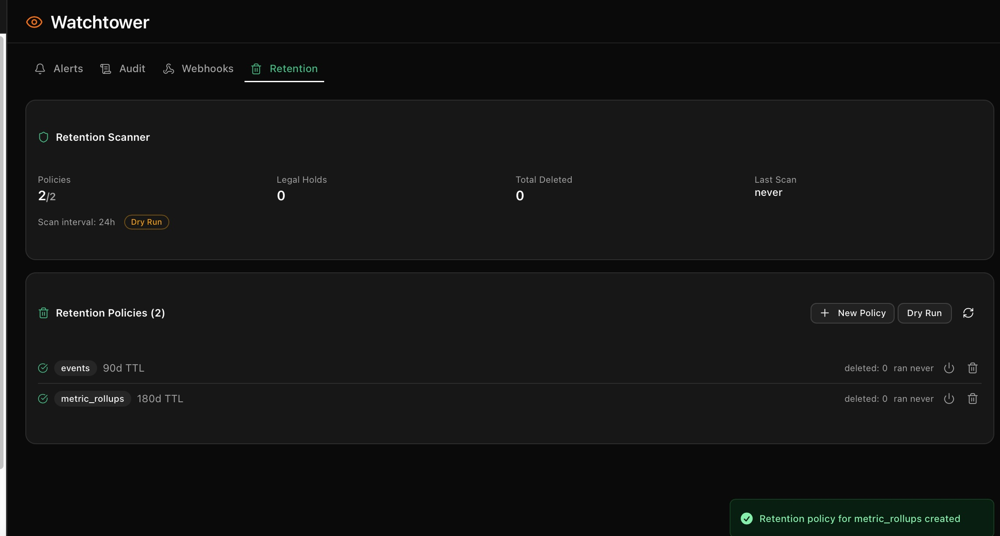

<p align="center">
  
</p>

<p align="center">
  <a href="https://github.com/jasondostal/cairn-mcp/releases"></a>
  <a href="LICENSE"></a>
  
  
</p>

---

Yet another MCP, right? Yeah, it's that. But here's why this one exists.

I'm a t-shaped engineer. PMP, SAFe Agilist, Certified Product Owner. But before any of that, I'm a systems person. Data centers, orchestration, automation. The kind of work that crosses 13 disciplines and stretches back to something you last touched 10 years ago.

I built Cairn for my workflow. At 1am, when I'm deep in something and I know the answer exists somewhere in the last three weeks of work but I don't want to spend 30 minutes digging and correlating. That emergency call, the panicked user coming to you as their only hope, and it's an issue buried in 6 systems you last touched in 2014.

Cairn is there.

*"Where did I put that singularity again? Let me just spawn a couple..."*

Sure, dedicated tools will probably beat a given Cairn feature when it's all they do. Cairn isn't built for single-purpose depth — but it still [scores 81.6% on LoCoMo](#benchmark). It's built for the systems person. The curious. The t-shaped. The ones who need a memory that works the way they do, across everything, all at once.

It's a self-hosted memory and orchestration layer for AI agents and humans. Store something once, find it later, across sessions, across projects. Four containers. `docker compose up`. Done.

<p align="center">
  
  <br>
  <sub>Chat creates a work item. Agent breaks it into subtasks. You review from your phone.</sub>
</p>

## Quick Start

### 1. Pull and run

```bash
curl -O https://raw.githubusercontent.com/jasondostal/cairn-mcp/main/docker-compose.yml
docker compose up -d
```

Four containers start:
- **cairn** on port 8000 (MCP server + REST API)
- **cairn-ui** on port 3000 (web dashboard)
- **cairn-db** (PostgreSQL 16 + pgvector)
- **cairn-graph** (Neo4j 5, knowledge graph)

Migrations run on first boot. Ready in about a minute.

### 2. Connect your IDE

Add this to your MCP config:

```json
{
  "mcpServers": {
    "cairn": {
      "type": "http",
      "url": "http://localhost:8000/mcp"
    }
  }
}
```

Where that goes:

| IDE | Config file |
|-----|------------|
| **Claude Code** | `.mcp.json` in your project root |
| **Cursor** | `.cursor/mcp.json` |
| **Windsurf** | `.windsurf/mcp.json` |
| **Cline** | MCP settings panel in VS Code |
| **Continue** | `.continue/config.yaml` |

Or run the setup wizard — it walks you through everything: LLM backend, database, embeddings, auth, and IDE configuration:

```bash
git clone https://github.com/jasondostal/cairn-mcp.git && ./cairn-mcp/scripts/setup.sh
```

Pick a tier (local dev, recommended, enterprise, or custom) and the wizard collects only what that tier needs. Supports `--dry-run` and `--non-interactive` for CI.

### 3. Use it

Tell your agent to remember something:

> "Remember that we chose PostgreSQL for storage because it handles hybrid search without a separate vector DB."

Search for it later:

> "What did we decide about the storage layer?"

That's it. 23 tools available. The ones you'll use most:

| Tool | What it does |
|------|-------------|
| `store` | Save a memory with auto-enrichment. Supports `event_at` and `valid_until` for bi-temporal tracking |
| `search` | Find memories (vector + keyword + recency + tags). Temporal filters: `as_of`, `event_after`, `event_before` |
| `recall` | Get full content for specific memory IDs |
| `orient` | Boot a session with rules, recent activity, beliefs, and open work |
| `rules` | Load behavioral guardrails (global or per-project) |
| `beliefs` | Durable epistemic state — crystallize, challenge, retract knowledge with confidence tracking |
| `work_items` | Create, claim, and complete tasks with dependencies and gates |
| `working_memory` | Capture ephemeral thoughts — hypotheses, questions, tensions — with salience decay. Lives alongside crystallized memories; resolving graduates into permanent memories or beliefs |
| `projects` | Manage project docs (briefs, PRDs, plans) |
| `code_query` | Structural queries: dependents, impact, callers, callees, dead code, complexity, hotspots |
| `arch_check` | Validate architecture boundary rules against imports |
| `dispatch` | Dispatch work to a background agent — tracked, briefed, heartbeating |

The rest: `modify`, `insights`, `think`, `status`, `consolidate`, `decay_scan`, `drift_check`, `ingest`, `deliverables`, `locks`, `suggest_agent`.

## What's in the box

**Memory that persists across sessions.** Your agent makes a decision at 2am. Next morning, different session, it finds that decision. That's the core. Bi-temporal tracking separates when something happened (`event_at`) from when you learned it (`created_at`). Memories that go unaccessed decay naturally; important ones are protected. Related memories get consolidated into higher-order insights automatically.

**Beliefs.** Durable epistemic state — knowledge held with confidence. Crystallize hypotheses into beliefs, challenge them with counter-evidence, retract them when wrong. Beliefs surface in session boot alongside rules and memories, giving agents a clear picture of what the organization knows and how confident it is.

**Search that fuses signals.** Vector similarity, recency, access frequency, keyword matching, and tag overlap blended via Reciprocal Rank Fusion. Filter by project, type, or time range. Temporal queries: "what did we know as of Tuesday?" via `as_of`, "what happened last week?" via `event_after`/`event_before`.

**Knowledge graph.** With Neo4j enabled, entities and facts get extracted into a graph that connects memories through shared people, places, projects, and concepts. Optional, but powerful when you're working across domains.

**Ephemeral memory.** Hypotheses, questions, tensions, and intuitions live alongside crystallized memories with decaying salience. Engage with an item to keep it alive, or let it fade naturally. When a thought crystallizes, resolve it into a permanent memory or belief and it graduates automatically. The Memories page unifies both lifecycles with OKLCH-accented toggle filters.

**Work management and multi-agent orchestration.** Hierarchical work items, dependency tracking, a dispatch queue, and gates that pause for human decisions. Typed agent definitions with capability enforcement, file-level resource locking, affinity-based routing, and persistent cross-dispatch learning. Agents accumulate institutional knowledge and get smarter with every task.

**Web dashboard.** Browse memories with OKLCH-colored toggle filters, score gradient bars, and shareable URL state. Explore the knowledge graph, view analytics, manage work items, chat with your memory. Port 3000.

<p align="center">
  
  <br>
  <sub>Memory growth by type, token usage tracking, and the full nav.</sub>
</p>

**Observability.** Watchtower is a six-phase enterprise observability stack, all manageable from a single tabbed UI page. Immutable audit trail for every state-changing operation. Webhook delivery with HMAC-SHA256 signing and retry. Rule-based health alerting against metrics and system health. Configurable data retention with legal hold and dry-run preview. Optional OpenTelemetry export — reads trace context, exports spans via OTLP, zero overhead when disabled.

<p align="center">
  
  <br>
  <sub>Watchtower: audit trail, alerting rules, webhook delivery, and data retention in one place.</sub>
</p>

**Code intelligence.** A standalone worker indexes codebases with tree-sitter (30 languages) and builds a code graph in Neo4j. The server queries the graph without ever touching source files. Ask structural questions — "what depends on this file?", "who calls this function?", "what's the blast radius?" — and get answers from the code graph. Call graph extraction, cyclomatic complexity, dead code detection. Enforce architecture boundaries with YAML rules. Works across projects.

<details>
<summary>Supported languages (30)</summary>

| Category | Languages |
|---|---|
| Systems | C, C++, Rust, Go, Zig |
| JVM | Java, Scala, Kotlin, Groovy |
| .NET | C# |
| Scripting | Python, Ruby, PHP, Lua, Bash |
| Web | TypeScript/TSX, HTML, CSS |
| Apple | Swift, Objective-C |
| ML/Scientific | OCaml, MATLAB |
| Config & Data | JSON, YAML, TOML, HCL (Terraform), Dockerfile, Makefile, SQL, Markdown |

</details>

**Multi-user authentication and RBAC.** Off by default, zero to enterprise in one command. `./scripts/setup.sh` includes auth configuration, or run `./scripts/setup-auth.sh` standalone. Auth mode selection (none / local JWT / OIDC SSO), JWT secret generation, OIDC provider validation with hints for Authentik, Keycloak, Auth0, Okta, and Azure AD. Personal Access Tokens for machine clients, stdio identity for MCP. Three roles, project-level scoping, first-user-becomes-admin. Groups with OIDC sync. See the **[Authentication Guide](docs/authentication.md)**.

**Session capture.** IDE hooks (Claude Code, Cursor, Cline, Windsurf) log every tool call. Next session boots warm. See [`examples/hooks/README.md`](examples/hooks/README.md).

**Backup and disaster recovery.** Cron-friendly scripts for PostgreSQL dump and Neo4j graph export with configurable retention. Tested restore procedures with migration safety checks. See the **[Backup Guide](docs/backup.md)**.

## Do I need an LLM?

No. Store, search, recall, and rules work without one. You lose auto-enrichment (summaries, tags, importance scoring), knowledge extraction, and chat.

If you want enrichment:

| Backend | Setup |
|---------|-------|
| **Ollama** (default) | Install [Ollama](https://ollama.com), pull a model. Cairn connects to `host.docker.internal:11434`. |
| **AWS Bedrock** | Set `CAIRN_LLM_BACKEND=bedrock`, export AWS creds. |
| **Google Gemini** | Set `CAIRN_LLM_BACKEND=gemini`, add `CAIRN_GEMINI_API_KEY`. Free tier available. |
| **OpenAI-compatible** | Set `CAIRN_LLM_BACKEND=openai`, add key. Works with OpenAI, Groq, Together, LM Studio, vLLM. |

## Configuration

All via environment variables. The ones that matter:

| Variable | Default | What it does |
|----------|---------|-------------|
| `CAIRN_PROFILE` | *(empty)* | Preset: `vector`, `enriched`, `knowledge`, `enterprise`. Sets capability defaults. |
| `CAIRN_LLM_BACKEND` | `ollama` | LLM provider: `ollama`, `bedrock`, `gemini`, `openai` |
| `CAIRN_DB_PASS` | `cairn-dev-password` | Database password. Change this for anything beyond local. |
| `CAIRN_AUTH_ENABLED` | `false` | Multi-user authentication (JWT, PATs, OIDC/SSO) |
| `CAIRN_AUTH_JWT_SECRET` | *(empty)* | JWT signing secret (required when auth enabled) |
| `CAIRN_OIDC_ENABLED` | `false` | OIDC/SSO integration (any OIDC-compliant provider) |
| `CAIRN_GRAPH_BACKEND` | *(disabled)* | Set to `neo4j` to enable knowledge graph |
| `CAIRN_KNOWLEDGE_EXTRACTION` | `false` | Entity/statement extraction on store |
| `CAIRN_EMBEDDING_BACKEND` | `local` | `local` (MiniLM, 384-dim) or `bedrock` (Titan V2, 1024-dim) |
| `CAIRN_AUDIT_ENABLED` | `false` | Immutable audit trail for state-changing operations |
| `CAIRN_WEBHOOKS_ENABLED` | `false` | HTTP webhook delivery with HMAC signing and retry |
| `CAIRN_ALERTING_ENABLED` | `false` | Rule-based health alerting against metrics |
| `CAIRN_RETENTION_ENABLED` | `false` | Data retention policies with TTL cleanup |
| `CAIRN_OTEL_ENABLED` | `false` | OpenTelemetry span export via OTLP |
| `CAIRN_OTEL_ENDPOINT` | *(empty)* | OTLP HTTP endpoint (e.g. `http://otel-collector:4318/v1/traces`) |
| `CAIRN_INGEST_DIR` | `/data/ingest` | Staging directory for file-path ingestion of large documents |
| `CAIRN_CODE_DIR` | `/data/code` | Root directory for code intelligence indexing (mount codebases here) |

Full reference is in [docker-compose.yml](docker-compose.yml). Every variable has a sensible default.

## Authentication

Off by default. The fastest way to enable it is through the setup wizard:

```bash
./scripts/setup.sh          # includes auth as step 2
./scripts/setup-auth.sh     # or run auth setup standalone
```

Three modes — no auth, local JWT, or OIDC/SSO. Generates secrets, validates
your identity provider's discovery endpoint, writes `.env`. Provider-specific
URL hints for Authentik, Keycloak, Auth0, Okta, and Azure AD. Both scripts
support `--dry-run` and `--non-interactive` for CI.

First user to register becomes admin. Role-based access control enforces
permissions across REST API, MCP HTTP, and the web UI. Personal Access Tokens
for machine clients, groups with OIDC sync.

See the **[Authentication Guide](docs/authentication.md)** for the full reference
covering all auth modes, OIDC provider configuration, and MCP client examples.

> **Security note:** Cairn's auth system is functional and production-tested but
> has not been independently audited. For network-exposed deployments, add TLS
> termination and network-level access controls.

## Code Intelligence

Code intelligence runs as a **standalone worker** that indexes source code and writes to Neo4j. The cairn server queries the graph but never touches source files directly. This separation means indexing doesn't block the event loop and the worker can run on the machine where code lives.

**Requirements:** Neo4j (the `cairn-graph` service in docker-compose) must be running.

### Quick start

```bash
# Index a single project (one-shot, no watching)
python -m cairn.code \
  --watch /path/to/your/repo:your-project \
  --neo4j-uri bolt://localhost:7687 \
  --cairn-url http://localhost:8000 \
  --no-watch

# Index and watch for changes (long-running)
python -m cairn.code \
  --watch /home/user/working/myproject:myproject \
  --watch /home/user/working/other:other \
  --neo4j-uri bolt://my-server:7687
```

### Environment variables

| Variable | Default | What it does |
|----------|---------|-------------|
| `CAIRN_NEO4J_URI` | `bolt://localhost:7687` | Neo4j bolt URI |
| `CAIRN_NEO4J_USER` | `neo4j` | Neo4j username |
| `CAIRN_NEO4J_PASSWORD` | `cairn-dev-password` | Neo4j password |
| `CAIRN_API_URL` | `http://localhost:8000` | Cairn server URL (for project ID resolution) |
| `CAIRN_API_KEY` | *(empty)* | API key if cairn auth is enabled |
| `CAIRN_CODE_PROJECTS` | *(empty)* | Comma-separated `project=path` pairs (alternative to `--watch`) |
| `CAIRN_CODE_WATCH` | `true` | Enable filesystem watching after initial index |
| `CAIRN_CODE_FORCE` | `false` | Force re-index even if content hash unchanged |

### Docker / remote codebases

Mount source code into the cairn container and set `CAIRN_CODE_DIR`:

```yaml
# docker-compose.yml
volumes:
  - /path/to/code:/data/code:ro   # read-only mount
environment:
  CAIRN_CODE_DIR: /data/code
```

Or run the worker on the code host and point it at your cairn + Neo4j instances:

```bash
CAIRN_NEO4J_URI=bolt://cairn-host:7687 \
CAIRN_API_URL=http://cairn-host:8000 \
CAIRN_CODE_PROJECTS="myproject=/home/user/code/myproject" \
python -m cairn.code
```

### What gets indexed

- **Symbols:** functions, classes, methods, interfaces, enums, React components/hooks
- **Relationships:** `IMPORTS` (file-level), `CALLS` (function-level), `CONTAINS` (parent-child)
- **Metadata:** signatures, docstrings, cyclomatic complexity, line numbers, content hashes
- **Languages:** Python, TypeScript/TSX, and 28 more (C, Rust, Go, Java, Ruby, etc.)

### Query examples (via `code_query` MCP tool)

| Action | What it does |
|--------|-------------|
| `dependents` | Files that import the target |
| `dependencies` | Files the target imports |
| `callers` | Functions that call the target |
| `callees` | Functions the target calls |
| `call_chain` | Trace call paths between two functions |
| `dead_code` | Functions with zero callers |
| `complexity` | Rank functions by cyclomatic complexity |
| `impact` | Blast radius — transitive dependents |
| `hotspots` | PageRank — structurally important files |
| `search` | Fulltext search over symbol names and docstrings |

## Architecture

```
MCP clients (Claude Code, Cursor, etc.)     REST clients (curl, web UI, hooks)
        |                                            |
        | MCP (stdio or HTTP)                        | REST API
        |                                            |
+-------v--------------------------------------------v--------+
|  cairn.server (MCP tools)     cairn.api (FastAPI endpoints) |
|                                                             |
|  core: memory, search, enrichment, extraction, clustering   |
|        work items, projects, working memory, thinking       |
|                                                             |
|  watchtower: audit trail, webhooks, alerting, retention     |
|              trace context, OTel export (optional)          |
|                                                             |
|  embedding: local (MiniLM) or Bedrock (Titan V2)            |
|  llm: Ollama, Bedrock, Gemini, OpenAI-compatible            |
+------+----------------------------------------------+------++
       |                                              |       |
       v                                              v       |
  PostgreSQL 16 + pgvector                    Neo4j 5 <-------+
                                             (optional)       |
                                                ^             |
  code worker (python -m cairn.code)            |      OTLP endpoint
  tree-sitter parsing, call graph      --------+       (optional)
  watches filesystem for changes
```

## Benchmark

Tested against [LoCoMo](https://github.com/snap-stanford/locomo), a long-conversation memory benchmark with 1,986 questions across five categories.

| System | Score | LLM |
|--------|-------|-----|
| **Cairn** | **81.6%** | Llama-3.3-70B |
| Human baseline | 87.9% | — |
| Letta/MemGPT | 74.0% | GPT-4o-mini |
| Mem0 | 66.9% | GPT-4o |

Test configuration: Titan V2 embeddings (Bedrock, 1024-dim), episodic ingestion (raw turns + two-pass fact extraction), Search V2 with graph-primary retrieval, type routing, cross-encoder reranking, LLM-as-judge evaluation. Full results and methodology in [`eval/`](eval/).

## Development

```bash
git clone https://github.com/jasondostal/cairn-mcp.git
cd cairn-mcp
cp .env.example .env
docker compose up -d --build
```

## Status

Cairn is under active development. It's a real system used daily in production, and it's evolving as I learn what actually works for agent memory. Migrations handle schema changes. If something breaks, [open an issue](https://github.com/jasondostal/cairn-mcp/issues).

## License

[GNU General Public License v3.0](LICENSE)
